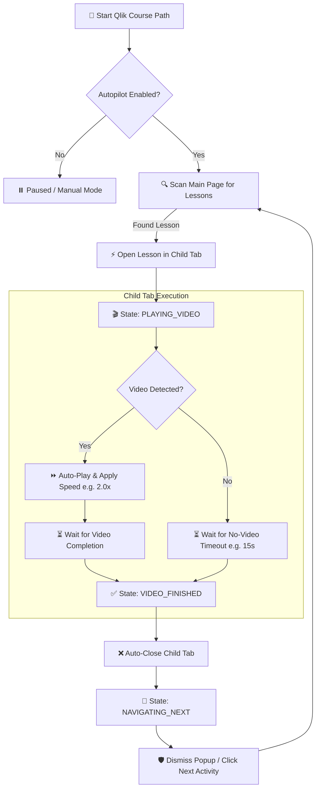

# 🚀 Qlik Sense Course Autopilot (Multi-Tab Edition v8.0)

<div align="center">


**An intelligent, multi-tab userscript that automates course pathway progression on the Qlik Learning Portal with custom video speed control, automated pop-up handling, and a glassmorphic HUD widget.**

[Quick Start Guide](#-step-by-step-installation-guide) • [Key Features](#-key-features) • [Workflow Diagram](#%EF%B8%8F-automation-workflow-state-machine) • [Troubleshooting](#-troubleshooting--faq)

</div>

---

## ✨ Key Features

<table>
  <tr>
    <td width="50%">
      <h3>🤖 Seamless Automated Progression</h3>
      <p>Automatically scans course paths, detects uncompleted activities (videos, reading modules, quizzes), and launches them without manual intervention.</p>
    </td>
    <td width="50%">
      <h3>⚡ Multi-Tab Architecture</h3>
      <p>Opens course activities in programmatically isolated child tabs, maintains execution state across windows, and auto-closes tabs upon lesson completion.</p>
    </td>
  </tr>
  <tr>
    <td width="50%">
      <h3>⏩ Variable Playback Speed Control</h3>
      <p>Enforces 2.0x playback (or custom speeds up to 16.0x) on HTML5, Wistia, Vimeo, and embedded video players to accelerate learning time.</p>
    </td>
    <td width="50%">
      <h3>🛡️ Smart Popup & Modal Bypasser</h3>
      <p>Automatically detects and handles native Qlik dialogs like <i>"Return to activity"</i>, <i>"Continue Learning"</i>, and modal navigation prompts.</p>
    </td>
  </tr>
  <tr>
    <td width="50%">
      <h3>📄 Non-Video Content Auto-Skip</h3>
      <p>Identifies static text or reading-only pages and auto-completes them after a configurable timeout (default 15 seconds).</p>
    </td>
    <td width="50%">
      <h3>💎 Glassmorphic HUD & Live Log Drawer</h3>
      <p>Sleek floating UI widget providing real-time execution status, live log inspection, manual state resets, and instant speed overrides.</p>
    </td>
  </tr>
</table>

---

## 🗺️ Automation Workflow (State Machine)

The script operates on an asynchronous state machine to coordinate parent and child browser tabs:



---

## 📥 Step-by-Step Installation Guide

<details open>
<summary><b>Step 1: Install Tampermonkey Browser Extension</b></summary>

To run userscripts, you must first install the **Tampermonkey** browser extension. Click the direct link below for your browser:

* 🌐 **Official Website**: [Tampermonkey.net](https://www.tampermonkey.net/)
* 🌐 **Chrome / Brave / Opera**: [Tampermonkey on Chrome Web Store](https://chromewebstore.google.com/detail/tampermonkey/dhdgffkkebhmkfjojejmpbldmpobfkfo)
* 🌐 **Microsoft Edge**: [Tampermonkey on Edge Add-ons](https://microsoftedge.microsoft.com/addons/detail/tampermonkey/iikflhplbekofaahbihcpmflfbdclnph)
* 🌐 **Mozilla Firefox**: [Tampermonkey on Firefox Add-ons](https://addons.mozilla.org/en-US/firefox/addon/tampermonkey/)
* 🌐 **Safari**: [Tampermonkey on Mac App Store](https://apps.apple.com/app/tampermonkey/id1482490089)

#### ⚠️ Enable "Allow User Scripts" (CRITICAL for Edge & Chrome)
Modern Edge & Chrome browsers block Tampermonkey userscripts from executing until you explicitly enable **Allow User Scripts**:

1. Right-click the **Tampermonkey extension icon** in your browser toolbar and click **Manage extension** (or navigate to `edge://extensions` / `chrome://extensions` and click **Details** under Tampermonkey).
2. Look for the **Allow User Scripts** option.
3. Toggle the switch to **ON** 🟢 (*"The extension will be able to run code..."*).
4. *(Optional)* If loading local script files, also toggle **ON** **"Allow access to file URLs"**.

> [!TIP]
> After installing, click the extension puzzle piece icon in your browser toolbar and **pin Tampermonkey** so it is easily accessible.

</details>

<details open>
<summary><b>Step 2: Add the Autopilot Script to Tampermonkey</b></summary>

Choose one of the two methods below to install the script:

#### Option A: Manual Copy & Paste (Recommended)
1. Open [`course_autopilot.user.js`](./course_autopilot.user.js) in this repository.
2. Select all text (`Ctrl + A` / `Cmd + A`) and copy it (`Ctrl + C` / `Cmd + C`).
3. Click the **Tampermonkey icon** in your browser toolbar.
4. Click **Create a new script...** (or open **Dashboard** ➔ **`+`** tab).
5. Delete any default template code inside the editor.
6. Paste the copied script code (`Ctrl + V` / `Cmd + V`).
7. Click **File** ➔ **Save** (or press `Ctrl + S` / `Cmd + S`).

#### Option B: Automatic Direct Install
If this repository is hosted on GitHub, click the raw link to trigger Tampermonkey's auto-installer prompt:
* 📥 [Click to Auto-Install `course_autopilot.user.js`](./course_autopilot.user.js)
* When the Tampermonkey tab opens showing the script metadata, click the green **Install** button.

</details>

<details open>
<summary><b>Step 3: Allow Browser Pop-Up Permission (CRITICAL)</b></summary>

> [!IMPORTANT]
> Because modern web browsers block automated multi-tab opening by default, you **MUST** grant pop-up permissions to Qlik Learning for Autopilot to operate correctly.

1. Navigate to [learning.qlik.com](https://learning.qlik.com).
2. Look at your browser address bar (top right or top left icon).
3. If a pop-up blocked icon appears, click it and select **"Always allow pop-ups and redirects from learning.qlik.com"**.
4. Alternatively, open Browser Settings -> **Privacy & Security** -> **Site Settings** -> **Pop-ups and redirects** -> Add `https://learning.qlik.com` to Allowed sites.

</details>

<details open>
<summary><b>Step 4: Activate & Run Autopilot</b></summary>

1. Open any [Qlik Course Pathway](https://learning.qlik.com/student/path/2399308-qlik-sense-data-architect).
2. Look for the floating **🤖 Autopilot** widget at the bottom-right corner of your screen.
3. Toggle **Enable Autopilot** to `ON`.
4. Sit back and watch your course progress automatically!

</details>

---

## 🎛️ Interactive HUD & Control Panel

The floating Glassmorphic HUD gives you full control over automation state:

```
+-------------------------------------------------------+
|  🤖 Qlik Autopilot v8.0                     [ _ ] [X] |
+-------------------------------------------------------+
|  Status: 🟢 RUNNING  |  State: PLAYING_VIDEO          |
|  [ OFF | ON ]  Enable Autopilot                       |
|                                                       |
|  Playback Speed:  [ 2.0 ]x                            |
|                                                       |
|  [ 🔄 Reset State (IDLE) ]  [ ⏭️ Skip Next Activity ]   |
|  [ 📜 View Live Logs (45) ]                           |
+-------------------------------------------------------+
| 📜 Live Output Console                                |
| [17:30:12] Detected HTML5 player. Setting speed 2.0x  |
| [17:30:15] Video ended. Initiating tab cleanup...     |
+-------------------------------------------------------+
```

### Controls Summary

| Control | Action | Purpose |
| :--- | :--- | :--- |
| **Enable Switch** | Toggle ON / OFF | Starts or pauses the automated polling and progression loop. |
| **Playback Speed** | Input (e.g. `2.0`, `3.0`) | Dynamically forces HTML5/Wistia video element playback rate. |
| **Reset State (IDLE)** | Click Button | Clears temporary session locks and returns state machine to IDLE. |
| **Skip Next Activity** | Click Button | Immediately bypasses current lesson and clicks the next module. |
| **Live Log Drawer** | Expandable Panel | Displays the last 50 execution logs for debugging. |

---

## ⚙️ Configurable Parameters

The script automatically preserves configuration across browser sessions via Tampermonkey storage:

| Parameter | Default Value | Description |
| :--- | :--- | :--- |
| `playbackSpeed` | `2.0` | Target video playback multiplier (1.0x - 16.0x). |
| `useSequentialMode` | `true` | Opens lessons sequentially by index rather than selector search. |
| `checkInterval` | `2500 ms` | Polling rate for detecting DOM elements and state transitions. |
| `videoFinishDelay` | `2000 ms` | Buffer delay after video ends before closing child tab. |
| `noVideoTimeout` | `15000 ms` | Max wait time before auto-closing non-video reading pages. |

---

## ❓ Troubleshooting & FAQ

<details>
<summary><b>❓ Pop-ups are blocked / Tabs do not open</b></summary>

Ensure you have allowed pop-ups for `https://learning.qlik.com`. When the script tries to open a new tab, check your browser's address bar for a blocked pop-up warning, click it, and set to **Always Allow**.
</details>

<details>
<summary><b>❓ Video speed stays at 1.0x on embedded players</b></summary>

Some embedded players (e.g., inside strict `iframe` containers) restrict external DOM access. Autopilot runs `@allFrames true` to inject into nested frames. If a video player is locked, adjust the speed input field in the HUD widget to trigger a re-apply command.
</details>

<details>
<summary><b>❓ The script is stuck on a page or popup</b></summary>

Click the **🔄 Reset State (IDLE)** button in the HUD widget. This unlocks the state machine and forces the script to re-evaluate the current page layout.
</details>

<details>
<summary><b>❓ How do I skip a module I've already completed?</b></summary>

Click **⏭️ Skip Next Activity** in the HUD widget to programmatically click the next navigation arrow in the syllabus.
</details>

---

## 💻 Tech Stack & Architecture

* **Language**: JavaScript (ES6+)
* **Manager Standard**: Greasemonkey / Tampermonkey API (`GM_setValue`, `GM_getValue`)
* **Styling**: Pure CSS Glassmorphism HUD (backdrop-filter blur, CSS variables)
* **Target Site**: [Qlik Learning Portal](https://learning.qlik.com)

---

## 📜 License

Distributed under the MIT License. See [`LICENSE`](./LICENSE) for details.
